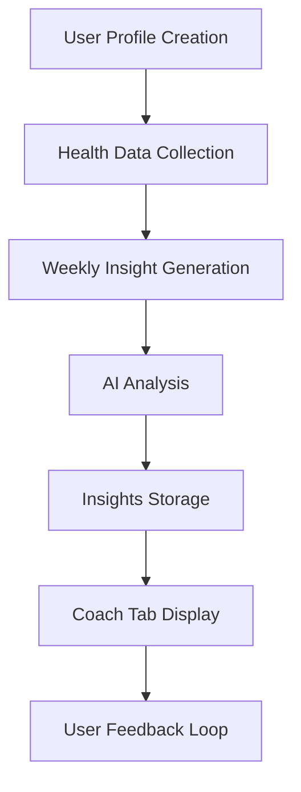

# AI Coach Design Document

## Architecture Overview

The AI Coach is built as an extension to the existing health tracking system, leveraging the current tech stack:

- **Frontend**: React 19 with TypeScript, Tailwind CSS
- **Backend**: Hono.js on Cloudflare Workers
- **Database**: Cloudflare D1 (SQLite)
- **AI**: Cloudflare AI for analysis and insights

## Component Design

### 1. Database Schema
```typescript
// User Profile Schema
interface UserProfile {
  id: number;
  age: number;
  gender: string;
  heightCm: number;
  weightKg: number;
  goals: string;
  activityLevel: string;
  bmi: number; // calculated
  createdAt: number;
  updatedAt: number;
}

// Weekly Insights Schema
interface WeeklyInsight {
  id: number;
  weekStartDate: string; // YYYY-MM-DD (Sunday)
  userId: number;
  insights: Insight[];
  recommendations: Recommendation[];
  habitFocus: string;
  generatedAt: number;
  isRead: boolean;
}

interface Insight {
  type: 'pattern' | 'trend' | 'correlation';
  title: string;
  description: string;
  dataPoints: string[];
}

interface Recommendation {
  title: string;
  description: string;
  priority: 'high' | 'medium' | 'low';
}
```

### 2. Frontend Components

#### ProfileSetupForm Component
- **Location**: `src/client/components/ProfileSetupForm.tsx`
- **Purpose**: One-time profile creation form
- **Fields**: Age, gender, height, weight, goals, activity level
- **Validation**: Zod schema validation
- **Styling**: Tailwind CSS with DaisyUI

#### CoachTab Component
- **Location**: `src/client/components/CoachTab.tsx`
- **Purpose**: Display weekly insights and recommendations
- **Features**:
  - Weekly insight cards
  - Read/unread status
  - Simple navigation
  - Responsive design

### 3. Backend API Endpoints

```typescript
// Profile Management
POST /api/coach/profile          // Create user profile
GET  /api/coach/profile          // Get user profile
PUT  /api/coach/profile          // Update user profile

// Insights Management
GET  /api/coach/insights         // Get weekly insights
POST /api/coach/insights/generate // Trigger insight generation
PUT  /api/coach/insights/:id/read // Mark insight as read
```

### 4. AI Integration

#### Insight Generation Process
1. **Data Collection**: Gather last 7 days of health data
2. **Pattern Analysis**: Identify trends in sleep, exercise, nutrition, mood
3. **Correlation Detection**: Find relationships between different metrics
4. **Insight Creation**: Generate 3 personalized insights
5. **Recommendation Generation**: Create 2 actionable recommendations
6. **Habit Focus**: Suggest 1 small habit change

#### AI Prompt Template
```typescript
const insightPrompt = `
Analyze the following health data for the past week and provide:
1. 3 personalized insights about patterns or trends
2. 2 specific recommendations for improvement
3. 1 small habit to focus on next week

Health Data: ${JSON.stringify(healthData)}
User Profile: ${JSON.stringify(userProfile)}
`;
```

### 5. Data Flow



### 6. Security Considerations
- User profile data encrypted at rest
- No sensitive medical information stored
- JWT-based authentication for API endpoints
- Rate limiting on insight generation

### 7. Performance Optimizations
- Lazy loading of insights
- Caching of frequently accessed data
- Efficient database queries with proper indexes
- Background processing for AI analysis

## UI/UX Design

### Profile Setup Screen
- Clean, minimal form design
- Progressive disclosure of fields
- Clear validation messages
- Success confirmation

### Coach Tab Interface
- Card-based layout for insights
- Color-coded priority levels
- Simple navigation between weeks
- Mobile-first responsive design

### Color Scheme
- Primary: Blue (insights)
- Secondary: Green (recommendations)
- Accent: Purple (habits)
- Background: Light gray
- Text: Dark gray