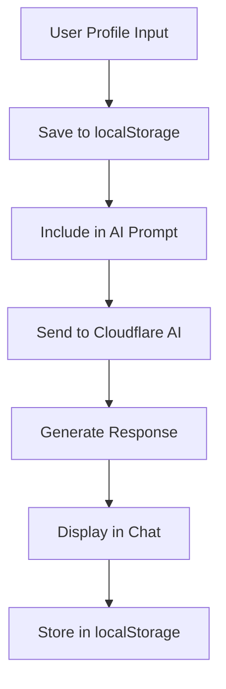

# Basic AI Coach Design Document

## Architecture Overview

The Basic AI Coach is built as a lightweight chat interface integrated into the existing health tracking system, using the current tech stack:

- **Frontend**: React 19 with TypeScript, Tailwind CSS, Kibo UI components
- **Backend**: Hono.js on Cloudflare Workers
- **AI**: Cloudflare AI for chat responses
- **Storage**: Browser localStorage for profile persistence

## Component Design

### 1. Data Storage

```typescript
// Basic profile storage schema
interface BasicUserProfile {
  profileText: string;
  createdAt: number;
  updatedAt: number;
}

// Chat message schema
interface ChatMessage {
  id: string;
  role: 'user' | 'assistant';
  content: string;
  timestamp: number;
}
```

### 2. Frontend Components

#### BasicCoachTab Component
- **Location**: `src/client/components/BasicCoachTab.tsx`
- **Purpose**: Main container for basic coach interface
- **Features**:
  - Profile input section
  - Chat interface
  - Message history display
  - Responsive layout

#### ProfileInput Component
- **Location**: `src/client/components/ProfileInput.tsx`
- **Purpose**: Text input for user profile
- **Features**:
  - Textarea for profile description
  - Save to localStorage
  - Character counter
  - Auto-save on blur

#### ChatInterface Component
- **Location**: `src/client/components/ChatInterface.tsx`
- **Purpose**: Interactive chat with AI coach
- **Features**:
  - Message display
  - Input field with Kibo UI AI Input
  - Loading states
  - Error handling
  - Scroll to bottom on new messages

### 3. Backend API Endpoints

```typescript
// Chat endpoint
POST /api/basic-coach/chat
{
  message: string,
  profileText: string
}
```

### 4. AI Integration

#### System Prompt
```typescript
const systemPrompt = `You are a friendly health coach AI. Use the user's profile information to provide personalized health guidance, tips, and support. Keep responses encouraging, practical, and focused on actionable advice. Profile: {profileText}`;
```

#### AI Request Format
```typescript
interface AIRequest {
  messages: Array<{
    role: 'system' | 'user' | 'assistant';
    content: string;
  }>;
  model: string;
}
```

### 5. UI Components

#### Kibo UI Integration
- **AI Input**: `import { AIInput } from '@kibo-ui/react'`
- **Chat Container**: Custom component with Tailwind styling
- **Message Bubbles**: Styled divs with user/assistant differentiation

#### Styling
```css
/* Chat interface styling */
.chat-container {
  @apply flex flex-col h-full max-w-2xl mx-auto;
}

.message-bubble {
  @apply rounded-lg px-4 py-2 max-w-[80%];
}

.user-message {
  @apply bg-blue-500 text-white ml-auto;
}

.assistant-message {
  @apply bg-gray-200 text-gray-800 mr-auto;
}
```

### 6. Data Flow



### 7. Error Handling

- **Network errors**: Display friendly error message
- **AI errors**: Fallback to generic response
- **Storage errors**: Graceful degradation with console warning
- **Validation**: Basic input sanitization

### 8. Performance Optimizations

- **Lazy loading**: Load chat history on demand
- **Debouncing**: Debounce profile save to reduce writes
- **Caching**: Cache AI responses for identical inputs
- **Responsive**: Mobile-first design with breakpoints

### 9. Security Considerations

- **Input sanitization**: Basic XSS prevention
- **No sensitive data**: Profile text is user-provided only
- **Local storage**: No server-side storage of conversations
- **HTTPS**: All requests over secure connection

## UI/UX Design

### Profile Input Screen
- Large textarea for profile text
- Character counter (500 char limit)
- Save button with loading state
- Auto-save on blur

### Chat Interface
- Full-screen chat container
- Scrollable message history
- Fixed input at bottom
- Typing indicators
- Error states

### Color Scheme
- Primary: Blue (user messages)
- Secondary: Gray (assistant messages)
- Background: Light gray
- Accent: Green (send button)

## Implementation Phases

1. **Phase 1**: Profile input and localStorage
2. **Phase 2**: Chat interface with mock responses
3. **Phase 3**: Cloudflare AI integration
4. **Phase 4**: Kibo UI components
5. **Phase 5**: Polish and testing